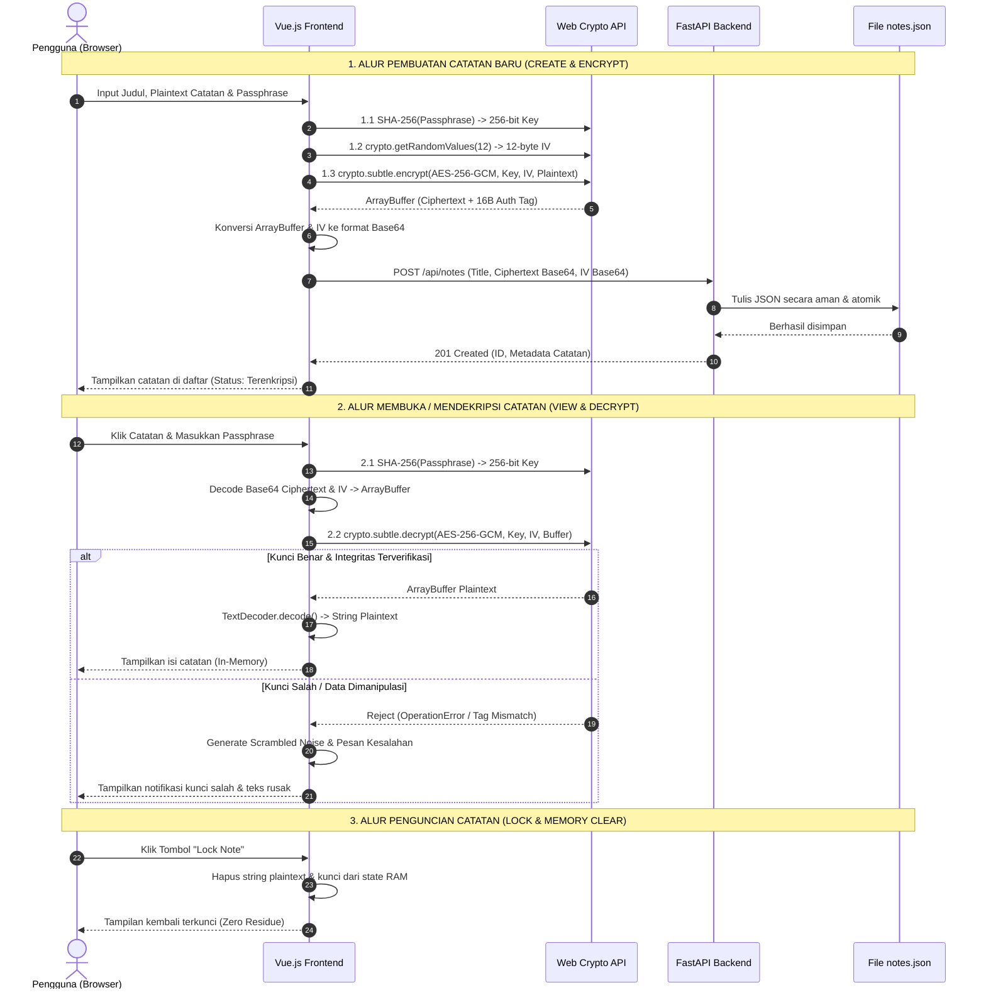

# 📑 DOKUMEN TEKNIS & PENJELASAN ALGORITMA SISTEM "SECRET NOTES"
## Arsitektur Kriptografi Zero-Knowledge Client-Side Encryption Menggunakan AES-256-GCM

---

## 📌 1. Ringkasan Eksekutif & Latar Belakang

Aplikasi **Secret Notes** adalah platform pencatatan digital berbasis web yang menerapkan prinsip keamanan **Zero-Knowledge Client-Side Encryption**. 

Pada arsitektur aplikasi web konvensional (*Server-Side Encryption*), data teks catatan dikirimkan ke server dan dienkripsi di sisi server. Pendekatan ini memiliki kelemahan mendasar: penyedia server (atau penyerang yang berhasil menyusupi database server) memiliki akses penuh terhadap kunci dan data *plaintext*.

**Secret Notes** memecahkan masalah tersebut dengan memindahkan seluruh komputasi kriptografi secara eksklusif ke dalam lingkungan *browser runtime* (sisi klien) pengguna menggunakan standar native **Web Crypto API (W3C Standard)**.

```
+-----------------------------------------------------------------------------+
|                                KLIENT (BROWSER)                             |
|                                                                             |
|  [Plaintext Catatan] + [Kunci / Passphrase]                                 |
|           │                                                                 |
|           ▼                                                                 |
|  [Key Derivation (SHA-256)] ──► Kunci Simetris 256-bit                      |
|  [CSPRNG (12-byte)]         ──► Initialization Vector (IV)                  |
|           │                                                                 |
|           ▼                                                                 |
|  [AES-256-GCM Engine]       ──► Ciphertext + 16-byte GMAC Auth Tag          |
|           │                                                                 |
+-----------┼─────────────────────────────────────────────────────────────────+
            │ (Hanya Ciphertext & IV Base64 yang dikirim lewat HTTP/HTTPS)
            ▼
+-----------------------------------------------------------------------------+
|                                SERVER (BACKEND)                             |
|                                                                             |
|  FastAPI Storage Service:                                                   |
|  - Menerima ID, Title, Ciphertext (Base64), IV (Base64), Timestamp          |
|  - Menyimpan secara atomik ke notes.json                                    |
|  - SERVER TIDAK PERNAH MENERIMA KUNCI ATAU PLAINTEXT (Zero-Knowledge)       |
+-----------------------------------------------------------------------------+
```

---

## 🔐 2. Landasan Teori Algoritma Kriptografi

Aplikasi ini menggabungkan beberapa konsep dan algoritma kriptografi modern:

### 2.1. AES-256-GCM (Advanced Encryption Standard - Galois/Counter Mode)

* **Ukuran Kunci (*Key Size*)**: 256 bit (32 byte) — memberikan ruang kunci sebesar $2^{256}$ kombinasi yang secara komputasi mustahil di-*brute force*.
* **Ukuran Blok (*Block Size*)**: 128 bit (16 byte).
* **Jumlah Putaran (*Rounds*)**: 14 putaran transformasi matriks *State* ($4 \times 4$ byte).
  * Tahapan tiap putaran: `SubBytes` (substitusi non-linear S-Box), `ShiftRows` (pergeseran baris siklik), `MixColumns` (perkalian matriks pada Galois Field $\text{GF}(2^8)$), dan `AddRoundKey` (operasi XOR dengan subkunci).
* **Mode Operasi AEAD (*Authenticated Encryption with Associated Data*)**:
  * **Kerahasiaan (*Confidentiality*)**: Disediakan oleh mode **Counter (CTR)**, di mana nilai pencacah (*counter*) yang dienkripsi di-XOR dengan blok data *plaintext*.
  * **Integritas & Otentisitas (*Integrity & Authenticity*)**: Disediakan oleh **GMAC (Galois Message Authentication Code)** menggunakan perkalian polinomial pada Galois Field $\text{GF}(2^{128})$.

#### Mengapa AES-256-GCM Dipilih (Dibanding ECB / CBC)?
| Parameter | AES-ECB | AES-CBC | AES-GCM (Digunakan) |
| :--- | :--- | :--- | :--- |
| **Kerahasiaan Pola** | ❌ Rentan (*Pattern Leaks*) | ✅ Aman dengan IV | ✅ Aman dengan IV |
| **Otentikasi / Integritas** | ❌ Tidak Ada | ❌ Perlu HMAC tambahan (EtM) | ✅ Bawaan (*Native 128-bit GMAC Tag*) |
| **Kerentanan Serangan** | Analisis Pola | *Padding Oracle Attacks*, *Bit-Flipping* | Kebal terhadap manipulasi bit tanpa kunci |
| **Paralelisasi Komputasi**| ✅ Ya | ❌ Tidak (Sekuensial berantai) | ✅ Sangat Cepat (Dapat diparalelkan) |

---

### 2.2. Key Derivation via SHA-256 (Secure Hash Algorithm)
Pengguna memasukkan kata sandi / passphrase dalam bentuk teks (*human-readable string*). Standar AES-256 membutuhkan kunci biner presisi **32 byte (256 bit)**.
* Fungsi derivasi mengonversi string passphrase menjadi byte UTF-8 via `TextEncoder`.
* Menghitung nilai *hash* kriptografis menggunakan `crypto.subtle.digest('SHA-256', keyBytes)`.
* Nilai digest 32-byte diimpor sebagai `CryptoKey` simetris untuk algoritma `AES-GCM`.

$$\text{CryptoKey} = \text{ImportKey}(\text{SHA-256}(\text{Passphrase}))$$

---

### 2.3. Pembangkitan Initialization Vector (IV) Acak
* Menggunakan **CSPRNG** (*Cryptographically Secure Pseudo-Random Number Generator*) native `crypto.getRandomValues(new Uint8Array(12))`.
* **Panjang IV**: 12 byte (96 bit), merupakan panjang rekomendasi standar NIST SP 800-38D untuk mode GCM agar efisiensi maksimal tanpa overhead komputasi GHASH tambahan pada IV.
* **Prinsip Keamanan (*Uniqueness*)**: Setiap operasi enkripsi menghasilkan IV baru. Menggunakan IV yang sama dua kali pada kunci yang sama (*IV reuse*) pada mode GCM akan merusak jaminan kerahasiaan dan integritas (serangan *Two-Time Pad* dan *GMAC Forgery*).

---

### 2.4. Struktur Tag Otentikasi (Authentication Tag)
Pada implementasi Web Crypto API, output enkripsi menyertakan tag otentikasi 16-byte (128-bit) yang digabungkan di akhir buffer *ciphertext*:

$$\text{EncryptedBuffer} = [\text{Ciphertext Bytes (Panjang } N\text{ Byte)}] + [\text{GMAC Tag (16 Byte)}]$$

Saat proses dekripsi, Web Crypto secara otomatis memverifikasi kecocokan tag ini:
* Jika tag cocok $\rightarrow$ Data dijamin asli, belum pernah dimodifikasi atau dirusak, dan didekripsi kembali ke *plaintext*.
* Jika kunci salah atau ciphertext diubah bahkan 1 bit saja $\rightarrow$ Operasi ditolak seketika (*OperationError*).

---

## 🔄 3. Alur Penggunaan Fitur & Algoritmanya Secara Berurutan

Berikut adalah alur lengkap sistem dari sudut pandang interaksi pengguna dan eksekusi algoritma di baliknya:



---

### 3.1. Fitur 1: Pembuatan Catatan Baru (*Create Note*)
1. **Input**: Pengguna mengisi `Title`, `Plaintext Content`, dan `Passphrase`.
2. **Key Derivation**: Passphrase diubah menjadi digest SHA-256 sepanjang 32 byte via `crypto.subtle.digest`.
3. **Pembangkitan IV**: Pembangkitan 12 byte angka acak semu terdistribusi seragam melalui `crypto.getRandomValues(new Uint8Array(12))`.
4. **Enkripsi AES-256-GCM**:
   * Plaintext dikonversi ke `Uint8Array` dengan `TextEncoder.encode()`.
   * Fungsi `crypto.subtle.encrypt({ name: 'AES-256-GCM', iv }, key, encodedPlaintext)` dieksekusi.
   * Hasilnya adalah `ArrayBuffer` berisi *Ciphertext* + *16-Byte GMAC Tag*.
5. **Serialisasi Base64**: Buffer biner dan IV diubah menjadi string Base64 (`bufferToBase64`) agar dapat ditransmisikan dalam format JSON.
6. **Transmisi Jaringan**: Frontend mengirimkan objek JSON melalui HTTP POST ke endpoint backend `/api/notes`:
   ```json
   {
     "title": "Rencana Skripsi",
     "encrypted_content": "k8P+8Z1m...[Base64]...",
     "iv": "vG7x+A9pL1q4...[Base64]..."
   }
   ```
7. **Penyimpanan Server**: Backend (FastAPI) memvalidasi skema data dengan Pydantic, lalu menyimpannya ke `backend/data/notes.json` menggunakan mekanisme penulisan atomik.

---

### 3.2. Fitur 2: Menampilkan Daftar Catatan (*Listing & Preview*)
1. Klien memanggil HTTP GET ke `/api/notes`.
2. Server mengembalikan metadata seluruh catatan (ID, judul, IV Base64, Ciphertext Base64, `created_at`, `updated_at`).
3. Catatan dirender dalam grid kartu berstatus **Terkunci (*Locked*)**. Konten catatan tidak didekripsi sebelum pengguna secara eksplisit memasukkan kunci.

---

### 3.3. Fitur 3: Membaca & Mendekripsi Catatan (*Read & Decryption Pipeline*)
1. Pengguna mengklik kartu catatan dan memasukkan `Passphrase` pada dialog pembuka kunci.
2. **Prapemrosesan Biner**:
   * String IV Base64 diubah kembali menjadi `Uint8Array` (12 byte) via `base64ToBuffer`.
   * String Ciphertext Base64 diubah menjadi `ArrayBuffer` via `base64ToBuffer`.
3. **Derivasi Kunci**: Passphrase di-*hash* dengan SHA-256 untuk merekonstruksi `CryptoKey` simetris 256-bit.
4. **Eksekusi Dekripsi & Validasi Otentikasi**:
   * Klien memanggil `crypto.subtle.decrypt({ name: 'AES-256-GCM', iv }, key, ciphertextBuffer)`.
   * **Dua Kemungkinan Hasil**:
     * **Kondisi Valid**: GMAC tag cocok $\rightarrow$ Data didekripsi dan dikonversi dari biner ke teks menggunakan `TextDecoder.decode()`. Konten ditampilkan di layar pengguna.
     * **Kondisi Tidak Valid (*Key Salah / Ciphertext Rusak*)**: Mesin kriptografi melempar pengecualian (*exception*). Sistem menangkap error, menampilkan peringatan kunci salah, dan menghasilkan teks teracak deterministik (*scrambled noise text*) untuk memberikan umpan balik visual yang aman tanpa membocorkan isi data asli.

---

### 3.4. Fitur 4: Penguncian Catatan & Pembersihan Memori (*Lock & Zeroization*)
1. Pengguna dapat menekan tombol **"Lock Note"** kapan saja.
2. Frontend secara proaktif mereset variabel `decryptedContent` dan *passphrase* dari memori Vue reactive state:
   ```javascript
   decryptedContent.value = null;
   passphrase.value = '';
   ```
3. Data sensitif tidak pernah disimpan pada media penyimpanan persisten browser (`localStorage`, `sessionStorage`, `IndexedDB`, atau `Cookies`), sehingga mencegah risiko pencurian data jika terjadi serangan *Cross-Site Scripting* (XSS) pada sesi berikutnya.

---

### 3.5. Fitur 5: Pembaruan Catatan (*Update & Re-encryption with Fresh IV*)
1. Pengguna membuka catatan (proses dekripsi berhasil), menyunting teks, dan menekan tombol simpan.
2. **Pembangkitan IV Baru (*Crucial Security Step*)**: Aplikasi **wajib** membangkitkan IV acak 12-byte baru untuk enkripsi ulang.
3. Plaintext baru dienkripsi dengan AES-256-GCM menggunakan IV baru tersebut.
4. Payload dikirim melalui HTTP PUT ke `/api/notes/{id}`.
5. Server memperbarui payload terenkripsi dan merekam stempel waktu `updated_at`.

---

### 3.6. Fitur 6: Penghapusan Catatan (*Delete Note*)
1. Pengguna menekan tombol hapus dan mengonfirmasi pada modal dialog.
2. Klien mengirim HTTP DELETE ke `/api/notes/{id}`.
3. Server menghapus catatan dari penyimpanan file secara atomik.

---

### 3.7. Fitur 7: Modul Visualisasi Blok Interaktif (*Block Visualizer Sandbox*)
Untuk tujuan presentasi dan edukasi konsep kriptografi, aplikasi menyertakan modul visualisasi interaktif per blok 16 byte (128-bit):
1. **Partisi Blok**: Plaintext/Ciphertext dipartisi secara visual menjadi potongan-potongan blok berukuran 16 byte.
2. **Inspeksi Heksadesimal**: Menampilkan representasi karakter ASCII dan nilai Hexadecimal (00-FF) tiap byte.
3. **Pemisahan Tag Otentikasi**: Memvisualisasikan secara jelas pemisahan antara blok data ciphertext (*payload*) dengan 16-byte *GMAC Authentication Tag* di bagian akhir.
4. **Playback Kontrol**: Fitur *Play, Pause, Step-by-Step, Restart*, dan pengaturan kecepatan animasi (*1x, 1.5x, 2x*) untuk mendemonstrasikan proses komputasi kriptografi langkah demi langkah.

---

## 📊 4. Struktur Data & Spesifikasi Teknis

### 4.1. Skema Data Backend (`notes.json`)
```json
[
  {
    "id": "c7a8b9e0-1234-5678-9abc-def012345678",
    "title": "Catatan Rahasia Skripsi",
    "encrypted_content": "3kJf9/Pq2...[Ciphertext + 16B Tag dalam Base64]...",
    "iv": "X8vQ2m1kL9p0...[12-byte IV dalam Base64]...",
    "created_at": "2026-09-29T11:30:00Z",
    "updated_at": "2026-09-29T11:30:00Z"
  }
]
```

### 4.2. Perbandingan Ukuran Biner Data
```
+-------------------------------------------------------------+
| Plaintext: "Hello World!" (12 byte)                         |
| + Enkripsi AES-256-GCM                                      |
| = Ciphertext Buffer: 12 byte ciphertext + 16 byte Auth Tag  |
| = Total Binary Buffer: 28 byte                              |
| + Base64 Encoding                                           |
| = Total Encrypted String: 40 karakter Base64                |
+-------------------------------------------------------------+
| IV: 12 byte biner -> 16 karakter Base64                     |
+-------------------------------------------------------------+
```

---

## 🛡️ 5. Analisis Keamanan Sistem (*Security Analysis*)

| Ancaman / Skenario Kejahatan Siber | Mitigasi pada Secret Notes | Status |
| :--- | :--- | :---: |
| **Penyadapan Database Server (*Database Breach*)** | Server hanya menyimpan ciphertext Base64. Tanpa passphrase yang ada di kepala pengguna, penyerang tidak dapat membaca isi catatan. | ✅ Aman |
| **Manipulasi Ciphertext (*Man-In-The-Middle / Bit-Flipping*)** | 16-Byte GMAC Authentication Tag akan gagal diverifikasi saat dekripsi, sehingga manipulasi seketika terdeteksi dan dibatalkan. | ✅ Aman |
| **Serangan *Known-Plaintext* atau *Two-Time Pad*** | Setiap catatan dan setiap pembaruan catatan selalu menggunakan **Fresh 12-byte CSPRNG IV**. | ✅ Aman |
| **Pencurian Kunci via XSS Persisten** | Kunci tidak disimpan di `localStorage` maupun `cookies`. Kunci hanya berada di variabel lokal memori RAM dan dapat dihapus seketika via fitur *Lock*. | ✅ Aman |
| **Penyadapan Jalur Komunikasi Jaringan (*Sniffing*)** | Dilindungi ganda: TLS/HTTPS pada transport layer dan AES-256-GCM pada application layer. | ✅ Aman |

---

## 🎯 6. Antisipasi Tanya-Jawab Dosen Penguji (*Q&A Defense*)

### Pertanyaan 1: Mengapa menggunakan Web Crypto API asli browser, bukan library pihak ketiga seperti CryptoJS?
> **Jawaban**:
> 1. **Keamanan & Performa**: Web Crypto API diimplementasikan pada level native (C++ / Rust) di dalam *browser engine*, sehingga dieksekusi jauh lebih cepat dan terhindar dari *timing attacks* (serangan saluran samping).
> 2. **CSPRNG Terstandarisasi**: Menggunakan `crypto.getRandomValues()` yang terikat langsung dengan entropi sistem operasi, bukan algoritma acak berbasis Math.random() yang tidak aman.
> 3. **Standar W3C Modern**: Mengurangi beban dependensi eksternal (*zero external crypto dependencies*), meminimalkan risiko serangan *supply chain*.

---

### Pertanyaan 2: Mengapa ukuran IV yang digunakan adalah 12 byte (96 bit), bukan 16 byte?
> **Jawaban**:
> Pada spesifikasi standar **NIST SP 800-38D**, IV berukuran 96 bit (12 byte) adalah ukuran *deterministik optimal* untuk GCM. Jika menggunakan IV selain 96 bit (misalnya 128 bit), algoritma GCM terpaksa harus menjalankan fungsi *hash* tambahan (GHASH) terlebih dahulu untuk memadatkan IV menjadi 96 bit sebelum memulai counter, yang menambah beban komputasi dan secara teoretis sedikit meningkatkan kemungkinan tabrakan (*collision*).

---

### Pertanyaan 3: Apa yang terjadi secara matematis jika seseorang mengganti 1 bit saja pada Ciphertext di database?
> **Jawaban**:
> Pada saat dekripsi dijalankan, algoritma Galois Counter Mode akan menghitung ulang nilai GHASH dari ciphertext yang diterima dan membandingkannya dengan 16-byte GMAC Authentication Tag. Perbedaan 1 bit pada ciphertext akan menghasilkan nilai GMAC yang sepenuhnya berbeda (*Avalanche Effect* pada GF($2^{128}$)). Akibatnya, `crypto.subtle.decrypt()` akan melempar error dan menolak mengeluarkan plaintext, sehingga integritas data terjamin 100%.

---

### Pertanyaan 4: Apakah server backend dapat memulihkan kata sandi jika pengguna lupa?
> **Jawaban**:
> **Tidak bisa**. Sesuai dengan filosofi **Zero-Knowledge Architecture**, server tidak pernah menyimpan *hash* kata sandi, tidak menyimpan *salt*, dan tidak menyimpan kunci dekripsi. Konsekuensi dari keamanan mutlak ini adalah jika pengguna lupa kata sandi, data catatan terenkripsi tersebut tidak dapat dipulihkan oleh pihak mana pun (*unrecoverable*).

---

### Pertanyaan 5: Mengapa digunakan SHA-256 untuk derivasi kunci?
> **Jawaban**:
> AES-256 memerlukan panjang kunci biner tepat 256 bit (32 byte). Panjang kata sandi yang diketikkan pengguna bersifat dinamis (misal 6 karakter atau 20 karakter). Fungsi *cryptographic hash* SHA-256 memetakan string dengan panjang berapapun menjadi digest tetap 256-bit dengan distribusi entropi yang merata, memenuhi syarat input `importKey` AES-256-GCM.

---

## 🏁 7. Kesimpulan

Proyek **Secret Notes** berhasil mengimplementasikan sistem manajemen catatan yang aman, tangguh, dan memenuhi standar kriptografi industri modern melalui:
1. Penerapan **Zero-Knowledge Architecture** di mana privasi pengguna terlindungi secara mutlak dari pihak ketiga maupun penyedia server.
2. Pemanfaatan mode **AES-256-GCM (AEAD)** yang menjamin aspek kerahasiaan (*confidentiality*) sekaligus integritas (*integrity*) data secara terpadu.
3. Media visualisasi edukatif per blok 16-byte yang memudahkan pemahaman komputasi kriptografi internal secara visual dan interaktif.
